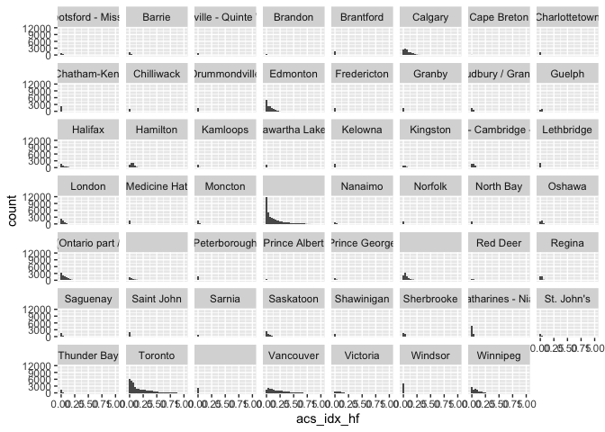
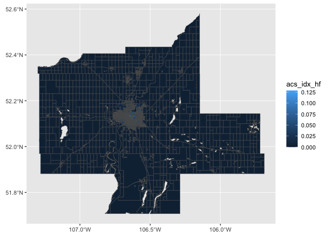

```r
options(cancensus.api_key = "CensusMapper_159fe4a88e8c934fece317e847beef84")
options(cancensus.cache_path = 'safe data/cache')
options(cancensus.cache_path = "/Users/dlf545/Desktop/cancensus") ##.rda files will be stored here
```

## Developing Saskatoon or Saskatchewan Transit Coverage 

We are using the [Spatial Access Measures](https://www150.statcan.gc.ca/n1/pub/27-26-0001/272600012023001-eng.htm) developed by Statistics Canada. From the website: 

> There are seven types of amenity categories within the Spatial Access Measures: primary and secondary educational facilities (EFs), postsecondary educational facilities (PSEFs), health care facilities (HFs), places of employment (EMPs), grocery stores (GSs), cultural and arts facilities (CAFs), and sports and recreational facilities (SRFs). For each amenity, there are four variants based on the transportation mode: access via public transit during peak hours, access via public transit during off-peak hours, access via cycling and access via walking.

## Data 


```r
transit_peak <- read_csv("acs_public_transit_peak.csv", name_repair = "universal")
```

```
## New names:
## Rows: 498547 Columns: 16
## ── Column specification
## ──────────────────────────────────────────────────────── Delimiter: "," chr
## (12): CSDNAME, CMANAME, PRNAME, acs_idx_hf, acs_idx_emp, acs_idx_srf, ac... dbl
## (4): DBUID, CSDUID, CMAUID, PRUID
## ℹ Use `spec()` to retrieve the full column specification for this data. ℹ
## Specify the column types or set `show_col_types = FALSE` to quiet this message.
## • `acs_lvl_gs-1` -> `acs_lvl_gs.1`
## • `acs_lvl_gs-3` -> `acs_lvl_gs.3`
## • `acs_lvl_gs-5` -> `acs_lvl_gs.5`
```

```r
transit_peak$acs_idx_hf <- as.numeric(transit_peak$acs_idx_hf)
```

```
## Warning: NAs introduced by coercion
```

```r
transit_peak$acs_idx_emp <- as.numeric(transit_peak$acs_idx_emp)
```

```
## Warning: NAs introduced by coercion
```

```r
transit_peak$acs_idx_srf <- as.numeric(transit_peak$acs_idx_srf)
```

```
## Warning: NAs introduced by coercion
```

```r
transit_peak$acs_idx_psef <- as.numeric(transit_peak$acs_idx_psef)
```

```
## Warning: NAs introduced by coercion
```

```r
transit_peak$acs_idx_ef <- as.numeric(transit_peak$acs_idx_ef)
```

```
## Warning: NAs introduced by coercion
```

```r
transit_peak$acs_idx_caf <- as.numeric(transit_peak$acs_idx_caf)
```

```
## Warning: NAs introduced by coercion
```

```r
transit_peak$acs_lvl_gs.1 <- as.numeric(transit_peak$acs_lvl_gs.1)
```

```
## Warning: NAs introduced by coercion
```

```r
transit_peak$acs_lvl_gs.3 <- as.numeric(transit_peak$acs_lvl_gs.3)
```

```
## Warning: NAs introduced by coercion
```

```r
transit_peak$acs_lvl_gs.5 <- as.numeric(transit_peak$acs_lvl_gs.5)
```

```
## Warning: NAs introduced by coercion
```

```r
transit_peak <- transit_peak %>%
                        group_by(CMANAME) %>%
                          mutate(n = n())
                  
transit_peak <- filter(transit_peak, n >= 1000)

transit_peak <- transit_peak %>% 
                  drop_na(CMANAME)
```

The dataset fields are as follows

| Field name      | Data type | Description                                                                                                            |
|-----------------|-----------|------------------------------------------------------------------------------------------------------------------------|
| DBUID           | int64     | Uniquely identifies a dissemination block (composed of the 2-digit province/territory unique identifier followed by the 2-digit census division code, the 4-digit dissemination area code and the 3-digit dissemination block code). |
| CSDUID          | int64     | Uniquely identifies a census subdivision (composed of the 2-digit province/territory unique identifier followed by the 2-digit census division code and the 3-digit census subdivision code). |
| CSDNAME         | object    | Census subdivision name.                                                                                              |
| CMAUID          | int64     | Uniquely identifies a census metropolitan area/census agglomeration.                                                  |
| CMANAME         | object    | Census metropolitan area or census agglomeration name.                                                               |
| PRUID           | int64     | Uniquely identifies a province or territory.                                                                         |
| PRCODE          | object    | Province or territory code.                                                                                          |
| acs_idx_hf      | float64   | Normalised value of a dissemination block's access to health care facilities.                                        |
| acs_idx_emp     | float64   | Normalised value of a dissemination block's access to employment.                                                    |
| acs_idx_srf     | float64   | Normalised value of a dissemination block's access to sports and recreation facilities.                              |
| acs_idx_psef    | float64   | Normalised value of a dissemination block's access to post-secondary education facilities.                          |
| acs_idx_ef      | float64   | Normalised value of a dissemination block's access to primary and secondary education facilities.                   |
| acs_idx_caf     | float64   | Normalised value of a dissemination block's access to cultural and arts facilities.                                  |
| acs_lvl_gs-1    | float64   | Time in minutes to reach the closest grocery store.                                                                 |
| acs_lvl_gs-3    | float64   | Time in minutes to reach the 3rd closest grocery store.                                                             |
| acs_lvl_gs-5    | float64   | Time in minutes to reach the 5th closest grocery store.                                                             |

## Creating average values per city


```r
transit_peak_city <- transit_peak %>%
                        group_by(CMANAME) %>%
                          summarize(acs_idx_hf = mean(acs_idx_hf, na.rm = TRUE),
                                    acs_idx_emp = mean(acs_idx_emp, na.rm = TRUE),
                                    acs_idx_srf = mean(acs_idx_srf, na.rm = TRUE),
                                    acs_idx_psef = mean(acs_idx_psef, na.rm = TRUE),
                                    acs_idx_ef = mean(acs_idx_ef, na.rm = TRUE),
                                    acs_idx_caf = mean(acs_idx_caf, na.rm = TRUE),
                                    acs_lvl_gs.1 = mean(acs_lvl_gs.1, na.rm = TRUE),
                                    acs_lvl_gs.3 = mean(acs_lvl_gs.3, na.rm = TRUE),
                                    acs_lvl_gs.5 = mean(acs_lvl_gs.5, na.rm = TRUE),
                                    freq_da = n()
                          )

transit_peak_city <- arrange(transit_peak_city, desc(acs_lvl_gs.1))

kable(transit_peak_city, "markdown")
```


|CMANAME                                                | acs_idx_hf| acs_idx_emp| acs_idx_srf| acs_idx_psef| acs_idx_ef| acs_idx_caf| acs_lvl_gs.1| acs_lvl_gs.3| acs_lvl_gs.5| freq_da|
|:------------------------------------------------------|----------:|-----------:|-----------:|------------:|----------:|-----------:|------------:|------------:|------------:|-------:|
|Abbotsford - Mission                                   |  0.0119171|   0.0174582|   0.0415322|    0.0061438|  0.0235906|   0.0060385|     25.57083|     27.07958|     29.19540|    1174|
|Prince George                                          |  0.0076564|   0.0000000|   0.0112274|    0.0087614|  0.0123258|   0.0070497|     23.71310|     35.16892|     38.84615|    1292|
|Medicine Hat                                           |  0.0042854|   0.0004970|   0.0051714|    0.0036758|  0.0173250|   0.0007261|     23.38206|     35.11397|     35.68217|    1704|
|Barrie                                                 |  0.0101239|   0.0074609|   0.0065776|    0.0000000|  0.0238699|   0.0034778|     23.23788|     32.71520|     34.42614|    1753|
|Saskatoon                                              |  0.0242003|   0.0057733|   0.0216653|    0.0260804|  0.0392633|   0.0096945|     21.34896|     27.88104|     30.39628|    4708|
|Oshawa                                                 |  0.0237781|   0.0305523|   0.0293542|    0.0001138|  0.0808486|   0.0086481|     21.30832|     30.25530|     32.63881|    3186|
|Greater Sudbury / Grand Sudbury                        |  0.0085180|   0.0023718|   0.0217879|    0.0116677|  0.0259806|   0.0041878|     21.03812|     30.03100|     34.46313|    1966|
|Guelph                                                 |  0.0193810|   0.0235860|   0.0152887|    0.0118995|  0.0436379|   0.0098759|     20.64728|     29.73364|     35.15888|    1369|
|North Bay                                              |  0.0033774|   0.0009909|   0.0059200|    0.0041123|  0.0120697|   0.0025252|     20.35491|     35.28251|     37.96154|    1191|
|Regina                                                 |  0.0190658|   0.0081433|   0.0249022|    0.0127497|  0.0453614|   0.0120739|     20.34958|     26.07196|     28.92476|    3768|
|London                                                 |  0.0277668|   0.0222987|   0.0218106|    0.0063212|  0.0496408|   0.0091997|     20.27508|     27.90562|     30.21708|    4488|
|Red Deer                                               |  0.0154487|   0.0068176|   0.0170148|    0.0000000|  0.0354493|   0.0084691|     20.26026|     31.26820|     33.82879|    1001|
|Kitchener - Cambridge - Waterloo                       |  0.0286551|   0.0432858|   0.0468122|    0.0182982|  0.0699918|   0.0223838|     20.23752|     27.71027|     30.07895|    4353|
|Moncton                                                |  0.0083302|   0.0082651|   0.0090510|    0.0113872|  0.0140716|   0.0930366|     20.09240|     30.91416|     35.40303|    2074|
|St. Catharines - Niagara                               |  0.0078274|   0.0110137|   0.0117420|    0.0056079|  0.0283770|   0.0079855|     20.08563|     30.61197|     33.50819|    5758|
|Nanaimo                                                |  0.0109775|   0.0223748|   0.0298457|    0.0103466|  0.0131243|   0.0171362|     19.92782|     26.85356|     33.13585|    1295|
|Kingston                                               |  0.0215448|   0.0081860|   0.0273558|    0.0175554|  0.0287035|   0.0559758|     19.80902|     27.46743|     29.32340|    1810|
|Thunder Bay                                            |  0.0099815|   0.0054870|   0.0035997|    0.0134583|  0.0276509|   0.0054250|     19.79983|     29.95527|     34.22249|    1715|
|Saint John                                             |  0.0034685|   0.0042997|   0.0056729|    0.0048473|  0.0070500|   0.0132584|     19.38210|     30.94302|     33.31092|    1926|
|Ottawa - Gatineau (partie du Qu<e9>bec / Quebec part)  |  0.0358536|   0.0261027|   0.0600388|    0.0408882|  0.0606870|   0.0989704|     19.24015|     26.27662|     29.35927|    3434|
|Halifax                                                |  0.0353573|   0.0381628|   0.0935610|    0.0495216|  0.0375888|   0.0140184|     19.10997|     24.93858|     27.21672|    3838|
|Calgary                                                |  0.0728373|   0.0549100|   0.0866062|    0.0304867|  0.1091649|   0.0487249|     19.06097|     27.26710|     29.53148|   11251|
|Charlottetown                                          |  0.0040867|   0.0067573|   0.0042443|    0.0205501|  0.0072975|   0.0055754|     18.91211|     30.49878|     34.61832|    1124|
|Edmonton                                               |  0.0522841|   0.0579481|   0.0280197|    0.0213997|  0.0583450|   0.0416650|     18.86248|     27.20050|     30.08282|   12482|
|Saguenay                                               |  0.0104821|   0.0125498|   0.0079976|    0.0324977|  0.0283162|   0.0146793|     18.82730|     29.11979|     33.27797|    2127|
|Qu<e9>bec                                              |  0.0510585|   0.0550198|   0.0934016|    0.0923342|  0.0696543|   0.0629548|     18.78060|     25.51599|     27.62584|    8901|
|St. John's                                             |  0.0088377|   0.0137147|   0.0146225|    0.0119383|  0.0099243|   0.0149157|     18.60253|     25.40925|     29.67710|    1781|
|Chilliwack                                             |  0.0032876|   0.0135720|   0.0080325|    0.0000086|  0.0075260|   0.0054118|     18.32857|     26.10864|     30.34122|    1058|
|Sherbrooke                                             |  0.0149823|   0.0081691|   0.0436153|    0.0424947|  0.0261728|   0.0195230|     17.99190|     26.93675|     27.57445|    2734|
|Hamilton                                               |  0.0516990|   0.0680516|   0.0422138|    0.0151059|  0.1001182|   0.0416452|     17.90160|     25.67577|     27.93964|    6204|
|Shawinigan                                             |  0.0046457|   0.0083771|   0.0148975|    0.0088386|  0.0184256|   0.0130217|     17.87189|     32.84401|     37.41379|    1059|
|Ottawa - Gatineau (Ontario part / partie de l'Ontario) |  0.0580875|   0.0503294|   0.1109065|    0.0259245|  0.0918038|   0.1127264|     17.54153|     25.82065|     29.01086|   10118|
|Winnipeg                                               |  0.0628654|   0.0617856|   0.0986468|    0.0344459|  0.1465452|   0.0432858|     16.95976|     24.45253|     27.29287|    8614|
|Toronto                                                |  0.1666977|   0.2490393|   0.1536947|    0.0306664|  0.2566423|   0.1280102|     16.84178|     24.27043|     26.56124|   34205|
|Montr<e9>al                                            |  0.1361589|   0.1719936|   0.1681718|    0.1787648|  0.1702394|   0.1328242|     16.36144|     23.31543|     25.07012|   36308|
|Victoria                                               |  0.0671921|   0.0262871|   0.1126568|    0.0205563|  0.0549242|   0.0453979|     16.17620|     22.37274|     24.60021|    2828|
|Chatham-Kent                                           |  0.0012115|   0.0023195|   0.0024624|    0.0003097|  0.0040627|   0.0004757|     15.02868|     35.11579|          NaN|    2055|
|Vancouver                                              |  0.1845487|   0.2469737|   0.1923665|    0.0516867|  0.1558367|   0.1619321|     14.97400|     21.40858|     23.97963|   15396|
|Fredericton                                            |  0.0009504|   0.0005111|   0.0022190|    0.0030752|  0.0014789|   0.0025696|     12.34559|          NaN|          NaN|    1312|
|Brantford                                              |  0.0022966|   0.0043447|   0.0033966|    0.0006601|  0.0095801|   0.0039894|     11.55106|     16.05851|     18.57576|    1779|
|Kamloops                                               |  0.0019205|   0.0001218|   0.0024825|    0.0003117|  0.0019319|   0.0017482|     11.52548|     14.50000|          NaN|    1460|
|Trois-Rivi<e8>res                                      |  0.0020839|   0.0013928|   0.0025204|    0.0034418|  0.0044004|   0.0043363|     11.21687|     15.67647|          NaN|    2194|
|Peterborough                                           |  0.0022530|   0.0007485|   0.0043259|    0.0000000|  0.0030184|   0.0017682|     11.18386|     13.04505|     14.23810|    1652|
|Kelowna                                                |  0.0022781|   0.0007423|   0.0027016|    0.0007183|  0.0012498|   0.0023576|     10.99715|     13.84615|          NaN|    1803|
|Windsor                                                |  0.0018302|   0.0019073|   0.0016236|    0.0003861|  0.0036338|   0.0009829|     10.66084|     14.60150|     16.12963|    4424|
|Norfolk                                                |  0.0005156|   0.0013823|   0.0007293|    0.0000000|  0.0030515|   0.0016674|     10.54299|     20.50000|          NaN|    1165|
|Lethbridge                                             |  0.0014741|   0.0003155|   0.0014942|    0.0006493|  0.0019488|   0.0004960|     10.24324|     12.55000|     14.56250|    1996|
|Kawartha Lakes                                         |  0.0003881|   0.0004631|   0.0008004|    0.0000000|  0.0014285|   0.0003586|     10.18966|     15.88462|          NaN|    1423|
|Belleville - Quinte West                               |  0.0000000|   0.0000000|   0.0000000|    0.0000000|  0.0000000|   0.0000000|          NaN|          NaN|          NaN|    1484|
|Brandon                                                |  0.0000000|   0.0000000|   0.0000000|    0.0000000|  0.0000000|   0.0000000|          NaN|          NaN|          NaN|    1097|
|Cape Breton                                            |  0.0000000|   0.0000000|   0.0000000|    0.0000000|  0.0000000|   0.0000000|          NaN|          NaN|          NaN|    1739|
|Drummondville                                          |  0.0000000|   0.0000000|   0.0000000|    0.0000000|  0.0000000|   0.0000000|          NaN|          NaN|          NaN|    1634|
|Granby                                                 |  0.0000013|   0.0000001|   0.0000245|    0.0000000|  0.0000140|   0.0000000|          NaN|          NaN|          NaN|    1310|
|Prince Albert                                          |  0.0000000|   0.0000000|   0.0000000|    0.0000000|  0.0000000|   0.0000000|          NaN|          NaN|          NaN|    1052|
|Sarnia                                                 |  0.0000000|   0.0000001|   0.0000000|    0.0000000|  0.0000000|   0.0000000|          NaN|          NaN|          NaN|    1390|

```r
ggplot(transit_peak, aes(acs_idx_hf)) +
        geom_histogram() +
        facet_wrap(~ CMANAME)
```

```
## `stat_bin()` using `bins = 30`. Pick better value with `binwidth`.
```

```
## Warning: Removed 4711 rows containing non-finite values (`stat_bin()`).
```

<!-- -->

## Creating quintiles of each metric for each city


```r
transit_peak <- transit_peak %>%
                        group_by(CMANAME) %>%
                          mutate(acs_idx_hf_n5 = ntile(acs_idx_hf, 5))
```

## Saskatoon map for fun


```r
sk_cma <- get_census(dataset='CA21', regions=list(CMA="47725"),
                          level='DB', use_cache = TRUE, geo_format = "sf")
```

```
## Reading geo data from local cache.
```

```r
sk_cma$GeoUID <- as.numeric(sk_cma$GeoUID)
sk_cma_transit <- left_join(sk_cma, transit_peak, by = c("GeoUID" = "DBUID"))


sk_int_plot <- ggplot(data = sk_cma_transit) + 
                  geom_sf(aes(fill = acs_idx_hf)) 
plot(sk_int_plot)
```

<!-- -->

```r
ggsave("sk_int_plot.jpg", dpi = 200, height = 4, width = 6)
```


